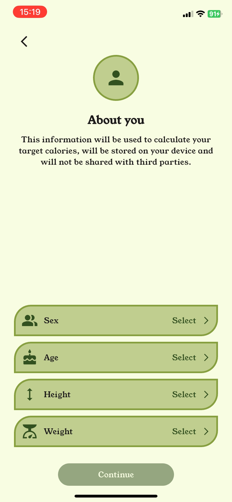
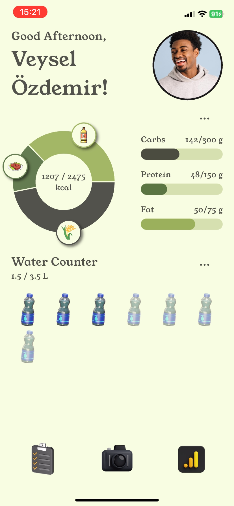
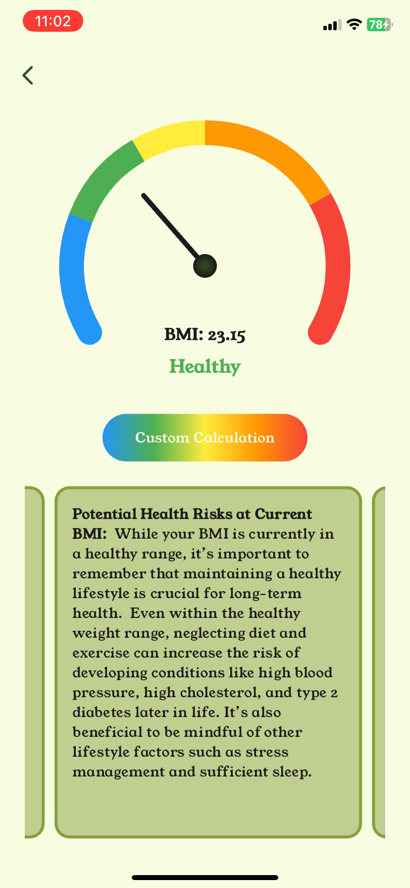
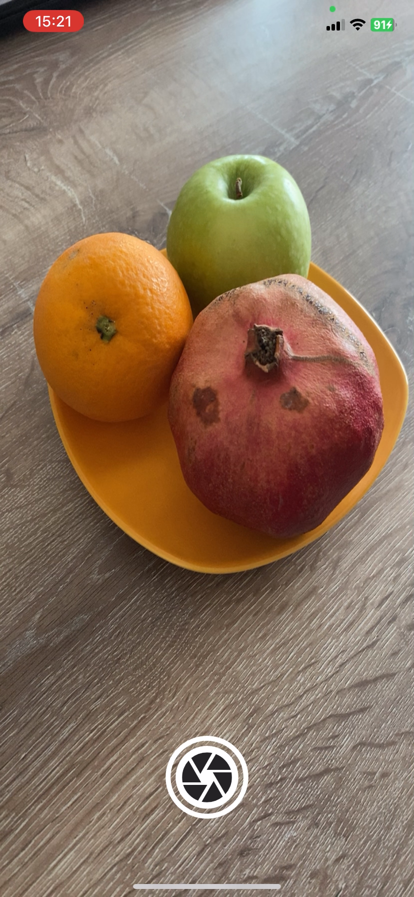
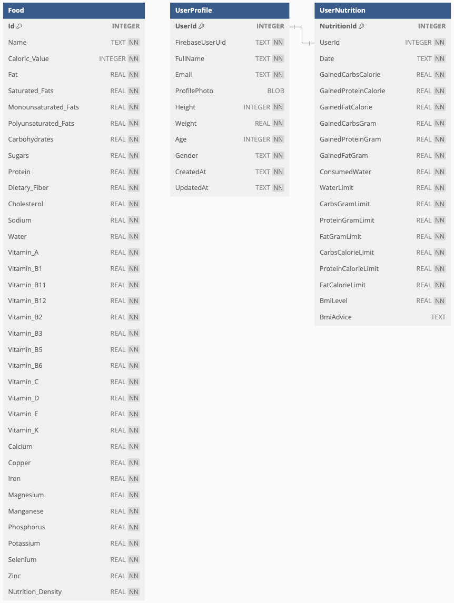

<p align="center">
  
</p>

# Vitalyzer: AI-Powered Food Scanner and Calorie Tracker

## Contents
- [**Overview**](#Overview)
- [**Key Features**](#Key-Features)
- [**Technologies Used**](#Technologies-Used)
- [**Screenshots**](#Screenshots)
- [**How to Run the Project**](#How-to-Run-the-Project)
- [**Database Schema**](#Database-Schema)
- [**Features in Development**](#Features-in-Development)
- [**License**](#License)
- [**Contact**](#Contact)

---

## Overview

**Vitalyzer** is a mobile application designed to revolutionize personal health management. By combining AI-driven tools with an intuitive user interface, the app enables users to track their daily caloric intake, macronutrient consumption, water intake, and BMI level. The app also features an AI-powered food scanner that provides detailed insights into meals and drinks, making healthy living more accessible and personalized.

---

## Key Features

- **AI-Generated Nutrition Plans**  
  Personalized daily calorie, macronutrient (carbs, protein, fat), and water intake recommendations based on user physical characteristics.

- **AI-Powered Food Scanner**  
  Capture and analyze meals or drinks to receive estimated caloric values and possible ingredients.

- **Daily Nutrition Tracker**  
  Monitor daily progress with interactive charts for calories, macronutrients, and water intake.

- **BMI Calculator with AI-Generated Advice**  
  Calculate BMI and receive personalized medical advice generated by the AI tool.

- **User Profile Management**  
  Update personal details, including height, weight, age, and gender, with recalculations for nutrition plans and BMI.

- **Secure Cloud Integration**  
  Sync user data, including profile information and progress, across devices using Firebase Cloud Firestore and Cloud Storage.

---

## Technologies Used

- **Front-end**: [Flutter](https://flutter.dev/) with Dart  
- **Local Storage**: SQLite and SharedPreferences  
- **Cloud Services**: Firebase Authentication, Firestore, and Cloud Storage  
- **AI Integration**: Gemini 1.5 Flash model via Google Generative AI  
- **State Management**: [GetX](https://pub.dev/packages/get) Flutter package  
- **Data Source**: [Food Nutrition dataset](https://www.kaggle.com/datasets/utsavdey1410/food-nutrition-dataset)

---

## Screenshots

Snapshots showcasing Vitalyzer's features and interfaces:  
| **About You** | **Home Page** | **BMI Gauge & Medical Advice** | **Camera Stream** | **Image Analysis** |
| --- | --- | --- | --- | --- |
|  |  |  |  |  |

---

## How to Run the Project

1. Clone the repository:
   ```bash
   git clone https://github.com/veysel-ozdemir/vitalyzer.git
   ```

2. Naivgate to the application directory (*consciously made double directory change*):
   ```bash
   cd vitalyzer;cd vitalyzer
   ```

3. Install dependencies
    ```bash
    flutter pub get
    ```

4. Configure Firebase

    - Create a new Firebase project
    - Download and add Google Services configuration files
    - Enable Authentication, Cloud Firestore, and Storage

5. Set up Gemini API

    - Obtain API credentials from Google Cloud Console
    - Configure API access in the project

6. Run the application

    ```bash
    flutter run
    ```

---

## Database Schema

The application uses SQLite for local storage with the following main tables:

- **Food**: Comprehensive nutritional information
- **UserProfile**: User credentials and physical characteristics
- **UserNutrition**: Daily nutrition tracking data

| **Entity-Relationship Diagram of the SQLite Database** |
| --- |
|  |

## Features in Development

- **Cloud-Based Data Synchronization:** Enable seamless data access across multiple devices while maintaining offline functionality.
- **Offline AI Capabilities:** Implement pre-trained local AI models for offline usage.
- **Improved Image Processing:** Enhance accuracy for diverse food types and conditions.
- **Expanded Database:** Include more regional cuisines and dietary-specific options.
- **Physical Exercise Features:** Add exercise videos to track calorie burn.
- **Motivational Tools:** Incorporate fasting programs and daily motivation notifications.

## License

This project is licensed under the MIT License - see the [LICENSE](LICENSE) file for details.

## Contact
For questions or collaboration, reach out at:
- **Email:** ozdemirsoftware.dev@gmail.com
- **GitHub:** [veysel-ozdemir](https://github.com/veysel-ozdemir/)
- **LinkedIn:** [Veysel Ozdemir](https://www.linkedin.com/in/ozdemir-veysel/)
- **Google Play Store:** [Developer Page](https://play.google.com/store/apps/dev?id=7737397220295288084&pli=1)
